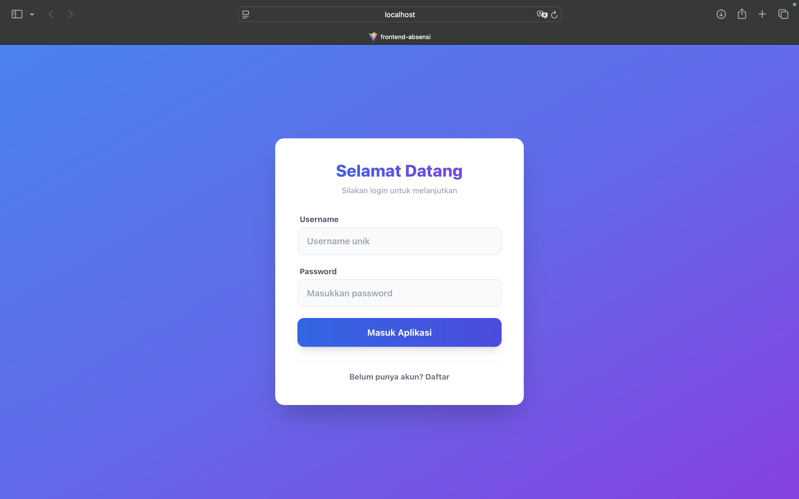
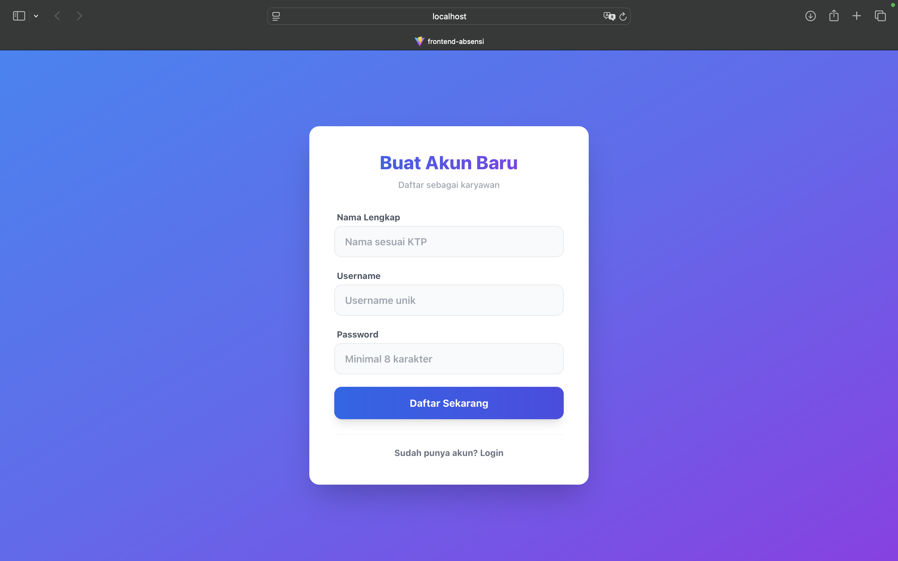
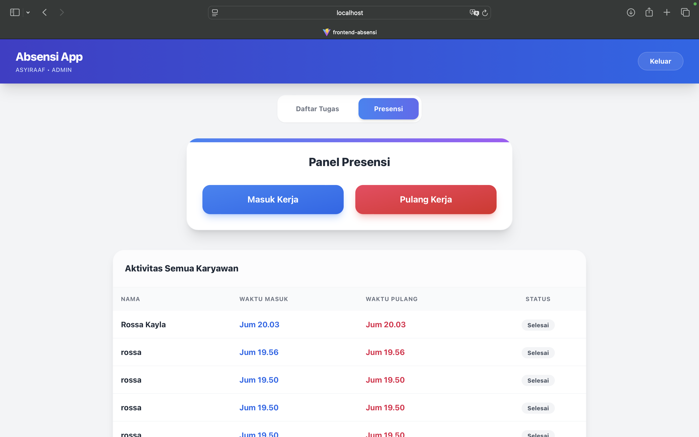
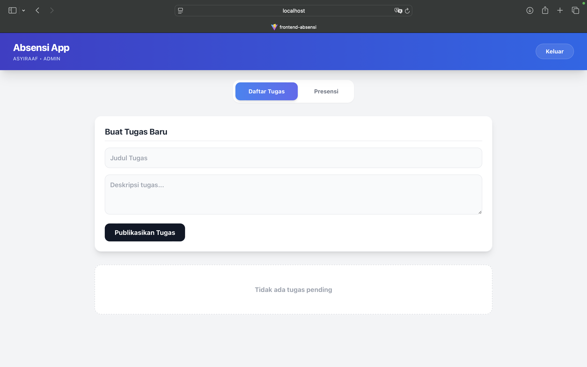
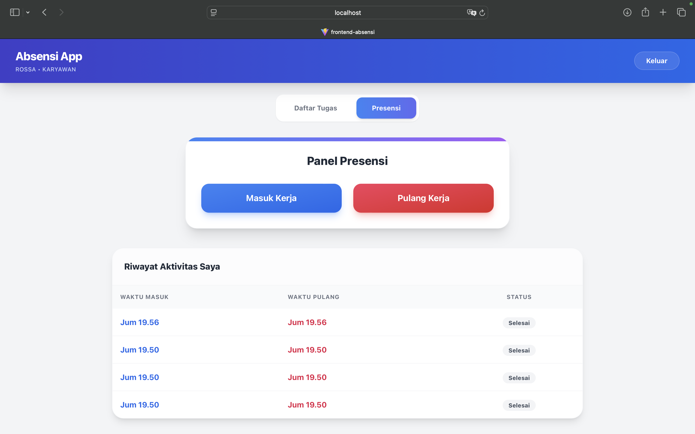
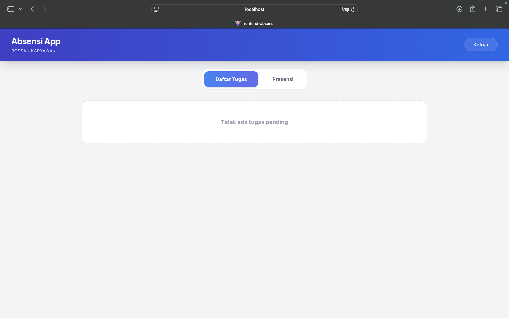

# 📱 Sistem Informasi Presensi & Manajemen Tugas (MERN Stack)



## ✨ Fitur Utama

### 👨‍💼 Admin (Manajer)
- **Manajemen Tugas:** Membuat dan mempublikasikan tugas baru untuk karyawan.
- **Monitoring Real-time:** Melihat siapa saja yang sudah masuk dan pulang kerja beserta waktunya.
- **Validasi Pekerjaan:** Memantau status penyelesaian tugas karyawan.

### 👷 Karyawan (User)
- **Presensi Mudah:** Sistem Check-in dan Check-out satu tombol.
- **Riwayat Pribadi:** Melihat log kehadiran dan jam kerja sendiri.
- **Task List:** Melihat daftar tugas harian dan menandainya sebagai selesai.
- **Keamanan:** Validasi password dan proteksi akun.

---

## 📸 Galeri Aplikasi

### 1. Autentikasi (Modern UI)
Halaman masuk dan pendaftaran dengan desain gradasi modern dan validasi input.

| Halaman Login | Halaman Daftar Akun |
| :---: | :---: |
|  |  |

### 2. Dashboard Admin
Admin memiliki kontrol penuh untuk memantau aktivitas perusahaan.

| Monitoring Presensi Karyawan | Form Input Tugas Baru |
| :---: | :---: |
|  |  |

### 3. Dashboard Karyawan
Antarmuka yang bersih untuk karyawan melakukan aktivitas harian.

| Panel Check-In/Out | Daftar Tugas Harian |
| :---: | :---: |
|  |  |

---

## 🛠️ Teknologi yang Digunakan

- **Frontend:** React.js (Vite), Tailwind CSS, Axios, React Router.
- **Backend:** Node.js, Express.js.
- **Database:** MySQL (Relational Database).
- **Authentication:** JSON Web Token (JWT) & Bcrypt (Hashing Password).

---

## 🚀 Cara Install & Menjalankan (Localhost)

Ikuti langkah-langkah berikut untuk menjalankan proyek ini di komputer Anda.

### Langkah 1: Clone Repository
```bash
git clone [https://github.com/username-anda/nama-repo.git](https://github.com/username-anda/nama-repo.git)
cd nama-repo

### 2. Setup Database
Buat database baru di MySQL bernama `absensi_app`, lalu jalankan query SQL berikut (atau import file `database.sql`):

```sql
CREATE TABLE users (
    id INT AUTO_INCREMENT PRIMARY KEY,
    username VARCHAR(100) NOT NULL UNIQUE,
    password VARCHAR(255) NOT NULL,
    role ENUM('admin', 'karyawan') NOT NULL DEFAULT 'karyawan',
    full_name VARCHAR(100),
    created_at TIMESTAMP DEFAULT CURRENT_TIMESTAMP
);

CREATE TABLE tasks (
    id INT AUTO_INCREMENT PRIMARY KEY,
    title VARCHAR(255) NOT NULL,
    description TEXT,
    status ENUM('pending', 'selesai') DEFAULT 'pending',
    created_by INT,
    completed_by INT,
    created_at TIMESTAMP DEFAULT CURRENT_TIMESTAMP,
    FOREIGN KEY (created_by) REFERENCES users(id) ON DELETE SET NULL
);

CREATE TABLE attendance (
    id INT AUTO_INCREMENT PRIMARY KEY,
    user_id INT NOT NULL,
    check_in_time DATETIME DEFAULT CURRENT_TIMESTAMP,
    check_out_time DATETIME DEFAULT NULL,
    latitude DECIMAL(10, 8) NULL,
    longitude DECIMAL(11, 8) NULL,
    FOREIGN KEY (user_id) REFERENCES users(id) ON DELETE CASCADE
);
```

### 3. Setup Backend
```bash
cd backend
npm install
npm start
```
*Server berjalan di port 5001*

### 4. Setup Frontend
Buka terminal baru:
```bash
cd frontend
npm install
npm run dev
```
*Akses aplikasi di http://localhost:5173*

## 🔑 Akun Demo (Opsional)

Jika Anda ingin langsung mencoba:
- **Admin:** user: `admin` | pass: `123` (Buat manual di register lalu ubah role di DB)
- **Karyawan:** user: `karyawan` | pass: `123`

---
Dibuat dengan ❤️ oleh [Asyiraaf]